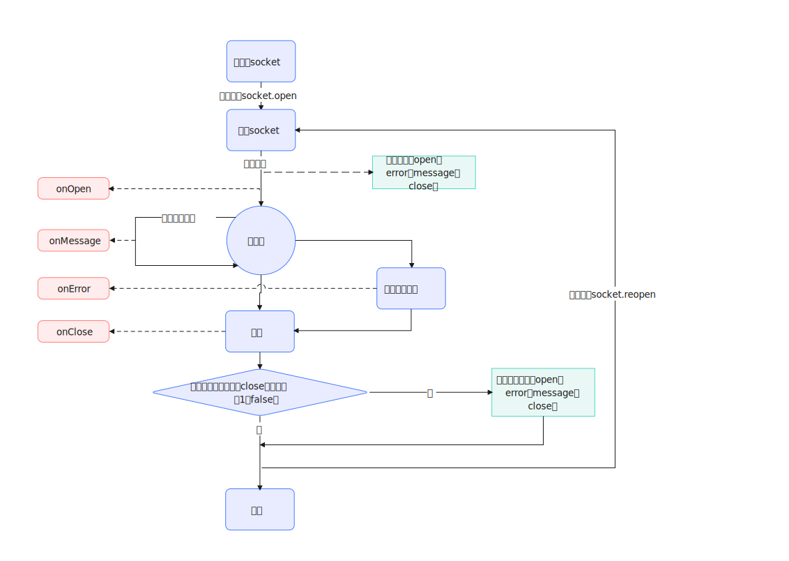

# easy-websocket-c

> 用于简化 WebSocket 操作的 TypeScript 库  
> 在原生 WebSocket 基础上增加了**断线自动重连**、**联网/断网检测**、**心跳保活**等功能

```bash
npm i easy-websocket-c
```

## 一、使用示例

### 简单用法

```javascript
import EasyWebSocketC from 'easy-websocket-c';

const ws = new EasyWebSocketC();

ws.open('ws://localhost:3000/socket')
  .onOpen(() => {
    console.log('opened');
  })
  .onMessage((ev) => {
    console.log('message', ev.data);
  })
  .onError((err) => {
    console.error(err);
  })
  .onClose((event) => {
    console.log('close', event);
  });
```

### 全配置写法

```javascript
import EasyWebSocketC from 'easy-websocket-c';

const ws = new EasyWebSocketC({
  // 自动重连：true | false | AutoContect 对象
  autoContect: {
    onlineContect: true,       // 断网后等待联网再重连，默认 true
    max: 0,                    // 最大重连次数，0 表示无限重试，默认 0
    timeContect: 3 * 1000,     // 断线后等待多久再重连（ms），0 为关闭，默认 3000
    abdicationTime: 0,         // 退避增量（ms），默认 0
    abdicationTimeMax: 60 * 1000, // 最大等待时间（ms），默认 60000
  },
  // 心跳保活：false | HeartContectOptions 对象
  heart: {
    message: 'ping',           // 心跳消息内容（必填）
    isFilter: true,            // 是否在 onMessage 中过滤心跳消息，默认 true
    timeContect: 5 * 1000,     // 心跳发送间隔（ms），默认 5000
    waitTime: 5 * 1000,        // 发送心跳后的额外等待时间（ms），默认 5000
    max: 0,                    // 预留字段，当前未使用
  },
});

ws.open('ws://localhost:3000/socket')
  .onOpen(() => console.log('opened'))
  .onHeartClose((ev) => console.warn('心跳异常断开', ev))
  .onOffline(() => console.warn('网络断开'))
  .onOnline(() => console.warn('网络恢复'));
```

## 二、配置说明

### EasyWebSocketCOptions

| 字段 | 类型 | 默认值 | 说明 |
| --- | --- | --- | --- |
| `autoContect` | `boolean \| AutoContect` | `true` | 自动重连配置。`true` 使用默认配置，`false` 关闭自动重连 |
| `heart` | `false \| HeartContectOptions` | `false` | 心跳保活配置。`false` 表示不启用心跳 |

### AutoContect（自动重连）

| 字段 | 类型 | 默认值 | 说明 |
| --- | --- | --- | --- |
| `onlineContect` | `boolean` | `true` | 断网后进入等待状态，联网后自动重连。WebSocket 无法稳定感知网络断开，建议保持开启 |
| `max` | `number` | `0` | 意外断线后的最大重连次数。`0` 表示无限重试 |
| `timeContect` | `number` | `3000` | 意外断线后的初始等待时间（ms）。`0` 表示关闭定时重连 |
| `abdicationTime` | `number` | `0` | 退避增量（ms）。每次重连失败后，等待时间递增 |
| `abdicationTimeMax` | `number` | `60000` | 最大等待时间（ms），限制实际重连间隔的上限 |

**重连等待时间计算公式：**

```
实际等待 = min(timeContect + 已重试次数 × abdicationTime, abdicationTimeMax)
```

示例：`timeContect = 3000`、`abdicationTime = 2000`、`abdicationTimeMax = 60000` 时，第 30 次重连的等待时间为 `min(3000 + 30 × 2000, 60000) = 60000` ms。

### HeartContectOptions（心跳保活）

| 字段 | 类型 | 默认值 | 说明 |
| --- | --- | --- | --- |
| `message` | `string` | — | 心跳消息内容（必填） |
| `isFilter` | `boolean` | `true` | 为 `true` 时，与 `message` 相同的消息不会触发 `onMessage` |
| `timeContect` | `number` | `5000` | 心跳发送间隔（ms） |
| `waitTime` | `number` | `5000` | 发送心跳后的额外容忍时间（ms）。超时未收到任何消息则主动断开并重连 |
| `max` | `number` | `0` | 预留字段，当前未使用 |

> 收到任意 WebSocket 消息都会刷新心跳计时。若超过 `waitTime + timeContect` 未收到消息，将触发 `onHeartClose` 并主动断开连接，随后走自动重连流程。

## 三、实例属性

| 属性 | 类型 | 说明 |
| --- | --- | --- |
| `socket` | `WebSocket` | 当前 WebSocket 实例 |
| `status` | `'CONNECTING' \| 'RUNNING' \| 'WAITTING' \| 'CLOSED'` | 当前运行状态 |

## 四、Methods

| 方法名 | 说明 | 参数 | 返回值 |
| --- | --- | --- | --- |
| `open` | 创建 WebSocket 连接 | `url: string \| URL, protocols?: string \| string[], forceOpen?: true` | `this` |
| `reopen` | 使用上次 `open` 的参数重新连接 | — | — |
| `send` | 发送数据 | `data: string \| ArrayBufferLike \| Blob \| ArrayBufferView` | `this` |
| `close` | 主动关闭连接 | `notClearListenEvent?: boolean, code?: number, reason?: string` | — |
| `clearListenEvent` | 清除所有已注册的事件回调（不含网络监听） | — | — |

**用法示例：**

```javascript
ws.open('ws://localhost:3000/socket');
ws.send('hello');
ws.reopen();
ws.close();                              // 主动关闭，清除回调
ws.close(false, 1000, 'custom reason');  // 带关闭码和原因
```

## 五、Events

所有事件监听方法均支持链式调用，返回 `this`。

| 方法名 | 说明 |
| --- | --- |
| `onOpen` | WebSocket 连接成功 |
| `onMessage` | 收到消息（心跳消息可在 `heart.isFilter` 为 `true` 时被过滤） |
| `onClose` | WebSocket 连接关闭 |
| `onError` | WebSocket 发生错误 |
| `onOnline` | 浏览器检测到网络恢复 |
| `onOffline` | 浏览器检测到网络断开 |
| `onHeartClose` | 心跳检测超时，连接被主动断开 |

```javascript
ws.onOpen((ev) => { /* ... */ })
  .onMessage((ev) => { /* ... */ })
  .onClose((ev) => { /* ... */ })
  .onError((ev) => { /* ... */ })
  .onOnline((ev) => { /* ... */ })
  .onOffline((ev) => { /* ... */ })
  .onHeartClose((ev) => { /* ... */ });
```

## 六、生命周期图示


